# TryKai — C4 Architecture Model

This document describes the architecture of the TryKai codebase using the
[C4 model](https://c4model.com): a set of nested diagrams that zoom in from "who uses this system
and what does it talk to" down to "which modules hold the rules".

It is a description of **what is in this repository today**, not of what is planned. Where the code
and the product documents disagree, the code wins and the disagreement is called out. Read it
alongside:

- `CONTEXT.md` — product intent, database schema, business rules
- `DECISIONS.md` — product, business and legal decisions (payments, fees, compliance)
- `DESIGN.md` — visual identity
- `STRATEGY.md` — market and growth strategy

| Level | Question it answers | Section |
| --- | --- | --- |
| 1 — Context | Who uses TryKai, and which outside systems does it depend on? | [Level 1](#level-1--system-context) |
| 2 — Container | What separately deployable/runnable pieces make up TryKai? | [Level 2](#level-2--containers) |
| 3 — Component | What are the major building blocks inside each container? | [Level 3](#level-3--components) |
| 4 — Code | How is the core domain logic actually written? | [Level 4](#level-4--code) |
| Supplementary | How do the pieces collaborate at runtime, and where do they run? | [Dynamic](#dynamic-views), [Deployment](#deployment-view) |

### Notation

Diagrams are Mermaid flowcharts drawn with C4 conventions rather than Mermaid's experimental C4
renderer, which overlaps its edge labels badly at this size. Every box states its C4 element type
and technology; arrows point in the direction of the dependency and are labelled with intent and
protocol.

| Appearance | Meaning |
| --- | --- |
| Dark navy box | Person (an actor outside the software) |
| Blue box | Container or component that is part of TryKai |
| Blue cylinder | Container that stores state |
| Grey box | External system we do not own |
| Dashed outline, grey text | Planned or decided but not built |
| Dashed border around a group | System or container boundary |

---

## Level 1 — System context

TryKai is a peer-to-peer marketplace for skills and experiences in Singapore. One person can be
both a host and a guest on the same account, but the two roles have distinct journeys, so they are
modelled as separate actors. A third actor matters architecturally: identity verification is a
**manual human review** performed outside the application, in the Supabase console.

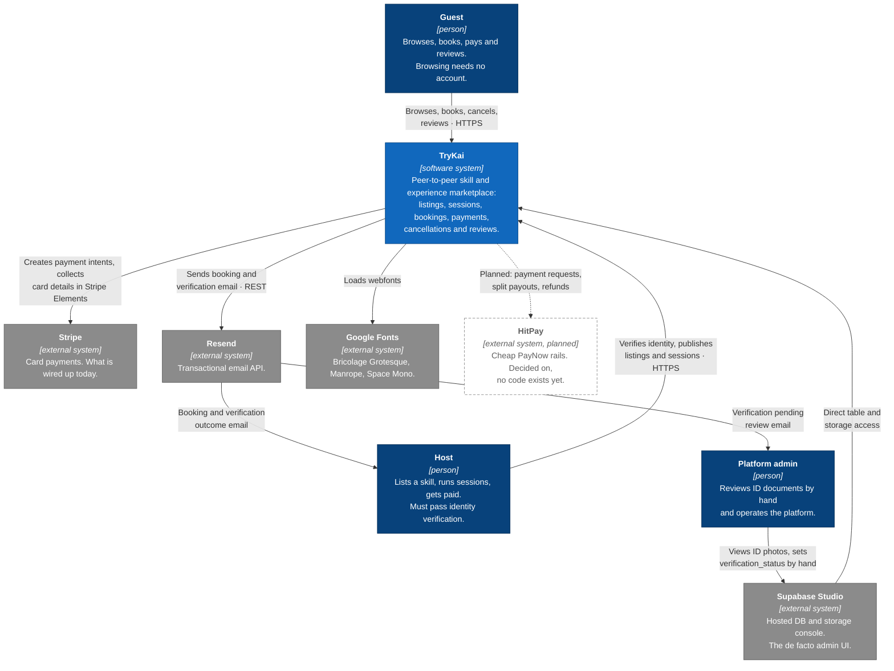

### Actors

| Actor | Description | Enters the system via |
| --- | --- | --- |
| Guest | Anyone browsing or booking. Browsing is anonymous; booking requires an account. | `Home`, `ListingDetail`, `Dashboard` |
| Host | A verified user who publishes listings and sessions. Gains the role by creating a first listing (`users.is_host`). | `VerifyIdentity`, `CreateListing`, `EditListing`, `Dashboard` |
| Platform admin | Reviews verification documents and fixes data by hand. Has no in-app admin UI. | Supabase Studio, email |

### External dependencies

| System | Why it exists | Where it is used |
| --- | --- | --- |
| Stripe | Payment processing today. Secret key server-side, publishable key in the SPA. | `supabase/functions/create-payment-intent`, `src/pages/ListingDetail.jsx` |
| Resend | All transactional email, called as a plain REST endpoint (no SDK). Currently sends from the shared `onboarding@resend.dev` test domain. | all three notification paths in `supabase/functions/` |
| Supabase Studio | The only interface for approving or rejecting host verification. | Manual, out of band |
| Google Fonts | Typography, imported from CSS rather than self-hosted. | `src/index.css` |
| HitPay | Decided replacement for Stripe (`DECISIONS.md`), blocked on business verification. **No HitPay code exists in the repository.** | Not yet present |

---

## Level 2 — Containers

TryKai is a browser SPA sitting on top of managed Supabase services. There is no application server
of our own: the SPA speaks directly to Postgres through PostgREST, and edge functions exist only
where a secret must be kept off the client (Stripe, Resend, the service-role key).

This is the single most important thing to understand about the architecture: **Row Level Security
in Postgres is the primary authorisation boundary**, because the browser is a first-class database
client.

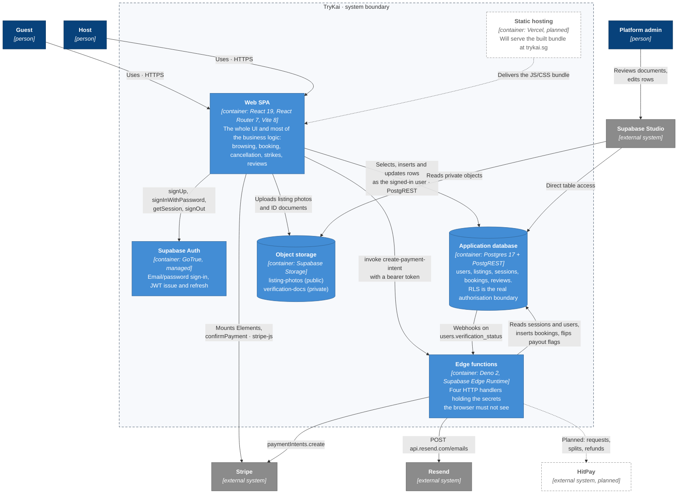

### Container catalogue

| Container | Technology | Responsibilities | Source |
| --- | --- | --- | --- |
| Web SPA | React 19, React Router 7, Vite 8, hand-written CSS (no UI library) | Rendering, routing, per-page auth guards, all listing/session/booking/review reads and writes, refund calculation, host strikes, listing deactivation | `src/`, `index.html`, `vite.config.js` |
| Static hosting | Vercel (planned) | Serving the built bundle | Not in repo; see `DECISIONS.md` |
| Supabase Auth | GoTrue (managed) | Credentials, JWTs, session refresh. Email confirmation is **off** locally (`enable_confirmations = false`) | `supabase/config.toml` |
| Application database | Postgres 17 + PostgREST | Persistence and, via RLS, authorisation | Schema documented in `CONTEXT.md`; **not in this repo as migrations** |
| Object storage | Supabase Storage | `listing-photos` public bucket (public URLs embedded in `listings.photo_urls`), `verification-docs` private bucket (`<uid>/id-photo.jpg`, `<uid>/selfie.jpg`) | `CreateListing.jsx`, `EditListing.jsx`, `VerifyIdentity.jsx` |
| Edge functions | Deno 2 | Anything needing `STRIPE_SECRET_KEY`, `RESEND_API_KEY` or `SUPABASE_SERVICE_ROLE_KEY` | `supabase/functions/` |

### Configuration and secrets

| Variable | Container | Purpose |
| --- | --- | --- |
| `VITE_SUPABASE_URL`, `VITE_SUPABASE_ANON_KEY` | SPA (build-time, public) | Supabase client |
| `VITE_STRIPE_PUBLISHABLE_KEY` | SPA (build-time, public) | Stripe Elements |
| `SUPABASE_URL`, `SUPABASE_ANON_KEY` | `create-payment-intent` | Per-request client that forwards the caller's JWT so RLS still applies |
| `SUPABASE_SERVICE_ROLE_KEY` | `release-payout` | Bypasses RLS to sweep all due sessions |
| `STRIPE_SECRET_KEY` | `create-payment-intent` | Creating PaymentIntents |
| `RESEND_API_KEY` | all three notifying functions | Sending email |

---

## Level 3 — Components

### 3a. Inside the Web SPA

Routing is flat: `App` mounts a persistent `Navbar` and seven routes. There is no auth context,
route-guard component or data-access layer — **each page independently calls
`supabase.auth.getSession()` and issues its own queries**, so the same redirect-if-signed-out block
is repeated verbatim in the four protected pages, and `ListingDetail` repeats a variant of it at
the moment the guest clicks Book.

```mermaid
flowchart TB
    classDef component fill:#85bbf0,stroke:#5d82a8,color:#000000
    classDef module fill:#63a2dd,stroke:#3b6ea5,color:#ffffff
    classDef container fill:#438dd5,stroke:#2e6295,color:#ffffff
    classDef ext fill:#8b8b8b,stroke:#5f5f5f,color:#ffffff

    subgraph spa["Web SPA · container boundary"]
        direction TB
        app["<b>App / Router</b><br/><i>[BrowserRouter]</i><br/>Seven routes plus a persistent Navbar"]:::component
        navbar["<b>Navbar</b><br/><i>[component]</i><br/>The only subscriber to onAuthStateChange;<br/>logo, create/dashboard links, logout"]:::component

        subgraph pages["Pages"]
            direction TB
            home["<b>Home</b><br/>Active listings, client-side<br/>category and area filters, hero"]:::component
            login["<b>Login</b><br/>Sign-in and sign-up in one form;<br/>inserts the users profile row"]:::component
            detail["<b>ListingDetail</b><br/>Listing, open future sessions,<br/>host reviews, booking trigger"]:::component
            checkout["<b>CheckoutForm</b><br/>Stripe PaymentElement<br/>and confirmPayment"]:::component
            create["<b>CreateListing</b><br/>Auth and verification gate,<br/>photo upload, listing insert"]:::component
            edit["<b>EditListing</b><br/>Edits the host's own listing<br/>and its photos"]:::component
            verify["<b>VerifyIdentity</b><br/>Uploads ID and selfie,<br/>sets status to pending"]:::component
            dash["<b>Dashboard</b><br/>Hosted sessions, listings, add-session,<br/>bookings, reviews, both cancellation flows"]:::component
        end

        subgraph shared["Shared UI"]
            direction TB
            card["<b>ListingCard</b>"]:::component
            review["<b>ReviewCard</b>"]:::component
            picker["<b>StarPicker</b>"]:::component
            policy["<b>CancellationPolicy</b><br/>Collapsible and static variants"]:::component
        end

        subgraph libs["Libraries"]
            direction TB
            sbclient["<b>lib/supabase</b><br/><i>[module]</i><br/>The single supabase-js client"]:::module
            cancelmod["<b>lib/cancellationPolicy</b><br/><i>[module]</i><br/>Policy table, cents formatting,<br/>48-hour refund rule"]:::module
        end
    end

    auth["<b>Supabase Auth</b><br/><i>[container]</i>"]:::container
    db[("<b>Application database</b><br/><i>[container]</i>")]:::container
    store[("<b>Object storage</b><br/><i>[container]</i>")]:::container
    fn["<b>Edge functions</b><br/><i>[container]</i>"]:::container
    stripe["<b>Stripe</b><br/><i>[external]</i>"]:::ext

    app -->|"always mounted"| navbar
    app --> home
    app --> login
    app --> detail
    app --> create
    app --> edit
    app --> verify
    app --> dash

    home --> card
    detail --> review
    detail -->|"once a client<br/>secret exists"| checkout
    detail --> policy
    create --> policy
    dash --> picker
    dash -->|"refund amount<br/>and wording"| cancelmod
    policy --> cancelmod

    navbar --> sbclient
    home --> sbclient
    login --> sbclient
    detail --> sbclient
    create --> sbclient
    edit --> sbclient
    verify --> sbclient
    dash --> sbclient

    sbclient -->|"auth.*"| auth
    sbclient -->|"from().select/insert/update"| db
    sbclient -->|"storage.upload,<br/>getPublicUrl"| store
    sbclient -->|"functions.invoke"| fn
    checkout -->|"confirmPayment"| stripe

    style spa fill:#f7f9fc,stroke:#33475b,stroke-dasharray: 6 4
    style pages fill:#eef4fb,stroke:#9db8d6
    style shared fill:#eef4fb,stroke:#9db8d6
    style libs fill:#eef4fb,stroke:#9db8d6
```

#### Page responsibilities

| Component | Route | Auth | Reads | Writes |
| --- | --- | --- | --- | --- |
| `Home` | `/` | none | `listings` + host name | — |
| `Login` | `/login` | none | — | Auth user, `users` |
| `ListingDetail` | `/listings/:id` | required only to book | `listings`, `sessions`, `reviews` | via `create-payment-intent` |
| `CreateListing` | `/create-listing` | required + `verification_status = approved` | `users` | `listing-photos`, `listings`, `users.is_host` |
| `EditListing` | `/edit-listing/:id` | required, scoped by `host_id` | `listings` | `listing-photos`, `listings` |
| `VerifyIdentity` | `/verify-identity` | required | `users` | `verification-docs`, `users` |
| `Dashboard` | `/dashboard` | required | `listings`, `sessions`, `bookings`, `reviews` | `sessions`, `bookings`, `reviews`, `users.host_strikes`, `listings.is_active` |

Two gating rules are enforced purely in the client and are worth naming explicitly, because they are
the kind of rule that must eventually be mirrored in RLS or a trigger:

- `CreateListing` redirects unverified or rejected users to `/verify-identity` and blocks pending
  ones with an under-review message.
- `Dashboard` decides who may cancel, who may review (`canLeaveReview` requires a past session and
  no existing review) and how many strikes a host has.

### 3b. Inside the edge functions

Four independent Deno handlers with no shared code between them — the CORS headers and the Resend
call are copy-pasted into each. One is called by the SPA, two by database webhooks, and the fourth
has no caller anywhere in the repository.

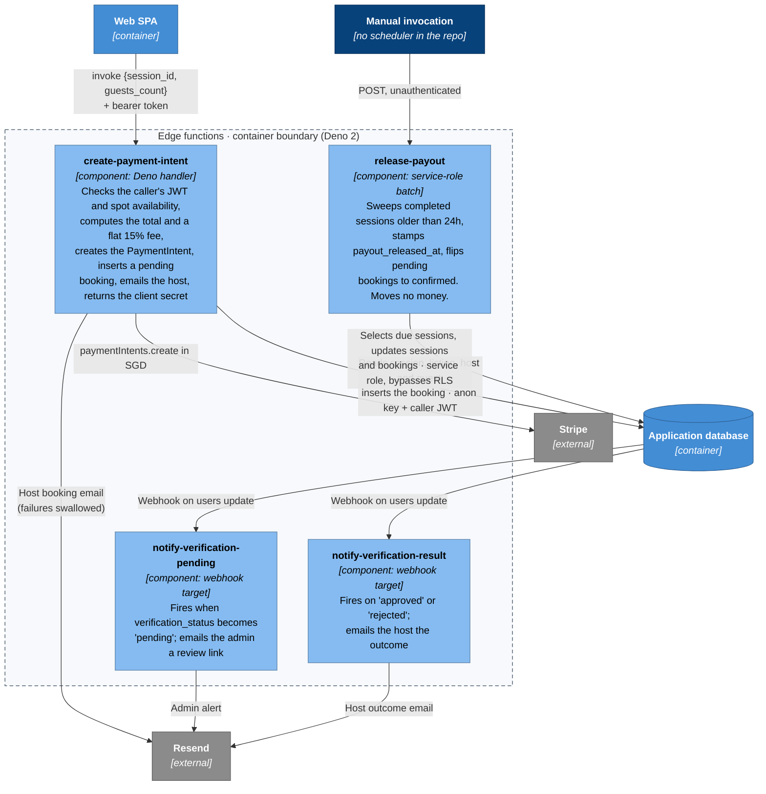

| Function | Trigger | `verify_jwt` | Credentials | Notes |
| --- | --- | --- | --- | --- |
| `create-payment-intent` | SPA `functions.invoke` | `false` — the handler checks the token itself with `auth.getUser()` | anon key + forwarded JWT | Charges a flat 15% fee, which contradicts the tiered fee structure in `DECISIONS.md` |
| `notify-verification-pending` | Postgres webhook on `users` | `false` | none beyond `RESEND_API_KEY` | Admin address and Supabase project URL are hard-coded |
| `notify-verification-result` | Postgres webhook on `users` | `false` | none beyond `RESEND_API_KEY` | Links to `trykai.sg`, which is not live yet |
| `release-payout` | None in the repo — no cron is configured | `false` | service role | Unauthenticated and unscheduled; see [gaps](#architectural-gaps-and-risks) |

### 3c. The data store

The schema is documented in `CONTEXT.md` and lives only in the hosted Supabase project; there is no
`supabase/migrations` directory, so the diagram below is derived from the queries the code actually
issues.

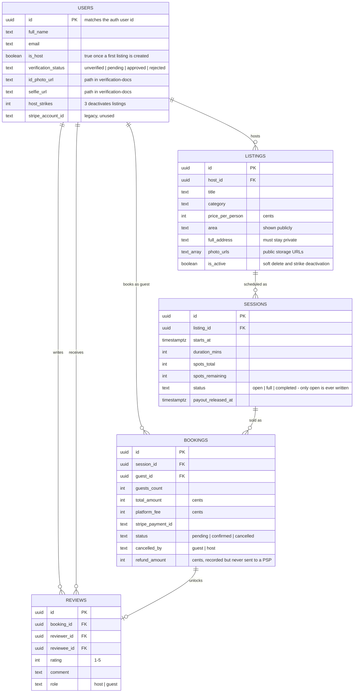

Invariants the architecture depends on:

- **Money is always integer cents.** Dollars only exist at the edges, in `formatCents`/`formatPrice`
  and the price input on the listing forms.
- **`listings.full_address` must never reach a public query.** No current `select` includes it
  except `EditListing`, which is scoped to the owning host.
- **Deletion is soft.** `Dashboard` sets `is_active = false`; nothing is ever removed.
- **Storage paths are namespaced by user id** (`<uid>/...`), which is what makes per-user storage
  policies expressible.

---

## Level 4 — Code

C4 treats this level as optional; only one area is worth drawing, because it is the one place where
a rule is written once and reused: the cancellation and refund policy.

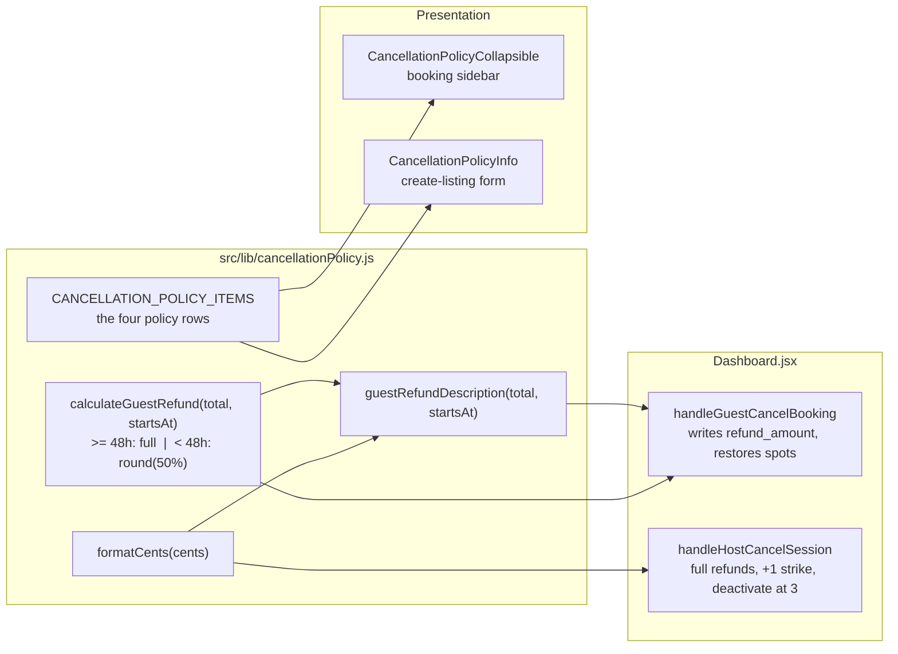

The 48-hour rule itself:

```13:22:src/lib/cancellationPolicy.js
export function calculateGuestRefund(totalAmountCents, sessionStartsAt) {
  const hoursUntil =
    (new Date(sessionStartsAt).getTime() - Date.now()) / (1000 * 60 * 60)

  if (hoursUntil >= 48) {
    return totalAmountCents
  }

  return Math.round(totalAmountCents * 0.5)
}
```

The other piece of money logic lives server-side and is a single line, which is exactly where the
documented tiered fee structure will have to land:

```41:42:supabase/functions/create-payment-intent/index.ts
    const total_amount = session.listings.price_per_person * guests_count
    const platform_fee = Math.round(total_amount * 0.15)
```

Everything else in `src/` is presentational or a direct Supabase query; there is no domain layer,
service layer or repository between the components and the database.

---

## Dynamic views

### Booking and payment

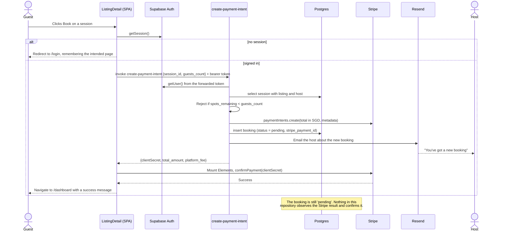

### Host identity verification

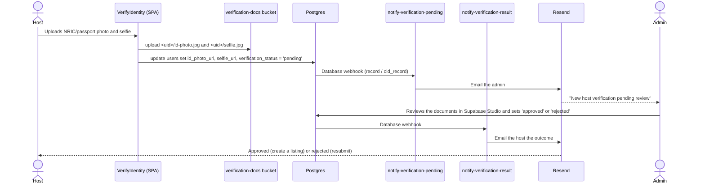

### Cancellation

Both flows run entirely in the browser as a sequence of unrelated writes; there is no transaction
and no server-side arbiter.

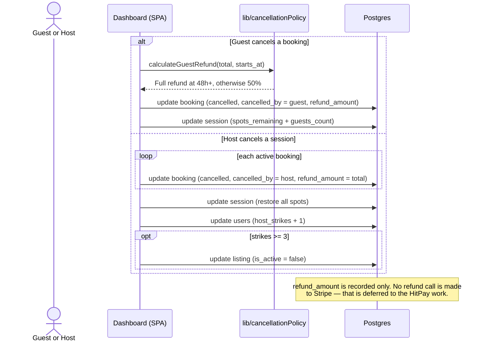

### Payout release

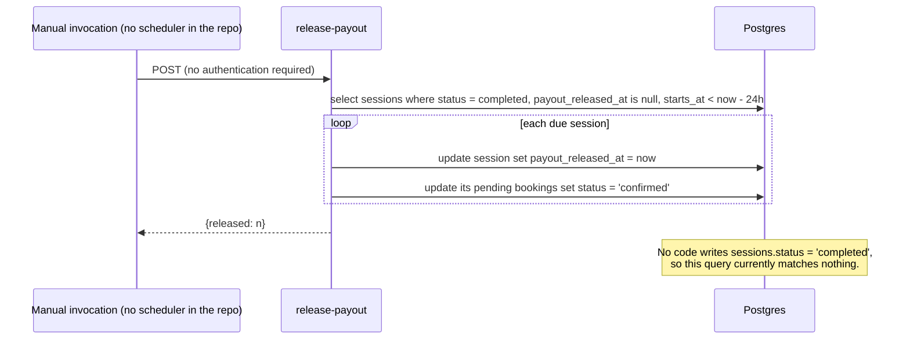

---

## Deployment view

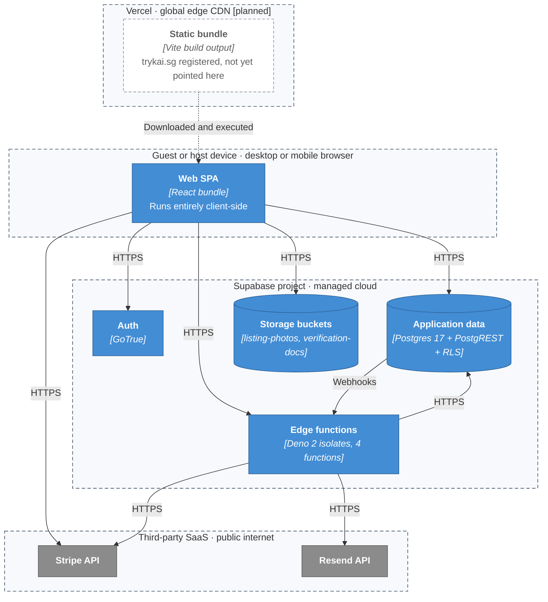

Local development uses the Supabase CLI, whose port allocation is fixed in `supabase/config.toml`:
API 54321, Postgres 54322, Studio 54323, Inbucket (email capture) 54324, analytics 54327. The SPA
runs on the Vite dev server.

---

## Cross-cutting concerns

**Authentication.** Supabase Auth issues a JWT that supabase-js stores and refreshes. The SPA reads
it with `getSession()`; `Navbar` is the only component subscribed to `onAuthStateChange`. Every
protected page re-implements the same "no session → redirect to `/login` carrying the intended
location" pattern.

**Authorisation.** Three separate mechanisms, in decreasing order of trustworthiness: Postgres RLS
(not visible in this repository), the JWT check inside `create-payment-intent`, and client-side
conditionals in the SPA. Ownership filters such as `.eq('host_id', userId)` on updates are defence
in depth from the client, not a boundary.

**Privacy.** `full_address` and the `verification-docs` bucket are the two pieces of genuinely
sensitive data. Both depend on server-side policies that live outside the codebase.

**Error handling.** Uniform and shallow: every async handler sets a local `error` string that
renders as a message. Edge functions return `{error: message}` with a 500. Email failures in
`create-payment-intent` are deliberately swallowed so a booking is never lost to a mail outage.

**Time and locale.** Everything is rendered in `Asia/Singapore` with `Intl.DateTimeFormat`, and
session creation parses local input as `+08:00`.

---

## Architectural gaps and risks

These are properties of the current model, recorded so the diagrams are not read as an endorsement.

1. **Nothing confirms a paid booking.** `create-payment-intent` inserts `status: 'pending'`, the
   browser confirms the payment with Stripe, and no Stripe webhook handler exists. The only code
   that writes `'confirmed'` is `release-payout`, 24 hours after the session. `Dashboard` contains
   a polling loop keyed on a `?booking=` query parameter that no other code ever sets.
2. **`spots_remaining` is never decremented.** `create-payment-intent` checks it and cancellation
   restores it, but no code in this repository reduces it when a booking is made. If that happens,
   it is a database trigger that is not version-controlled here.
3. **`release-payout` is unauthenticated, unscheduled and currently inert.** It runs with the
   service role key, `verify_jwt = false`, takes no arguments and has no cron entry in
   `supabase/config.toml`. It also selects on `sessions.status = 'completed'`, a value nothing in
   this repository ever writes, so even when invoked it matches no rows.
4. **The database is not code.** No `supabase/migrations`, no RLS policies, no webhook definitions
   in the repository. The most important authorisation boundary cannot be reviewed, diffed or
   recreated from this checkout.
5. **Marketplace state transitions run in the browser.** Host strikes, listing deactivation, spot
   restoration and refund amounts are written by `Dashboard.jsx` as a series of independent
   requests. A partial failure or a crafted request leaves inconsistent state.
6. **The fee logic contradicts the documented policy.** A flat 15% is hard-coded while
   `DECISIONS.md` specifies a tiered structure with a PayNow discount, a $2 floor and a new-host
   waiver.
7. **Refunds are recorded, never issued.** `refund_amount` is written to `bookings`; no PSP refund
   call exists anywhere.
8. **Payments are the pending migration.** Stripe is wired in end to end; HitPay, which
   `DECISIONS.md` treats as settled, has no representation in the code. Replacing it touches
   `create-payment-intent`, `ListingDetail`, the `bookings` columns, and adds the webhook and refund
   paths that are missing today.

## Keeping this model current

The diagrams are Mermaid, so they render on GitHub and diff as text. Update them when any of the
following changes, because each one alters a level of the model:

| Change | Level to update |
| --- | --- |
| A new external service or actor | Level 1, deployment |
| A new edge function, bucket, or deploy target | Level 2, deployment, dynamic view |
| A new route, page or shared module | Level 3a |
| A new table, column or webhook | Level 3c |
| A change to fee or refund rules | Level 4, dynamic views |
